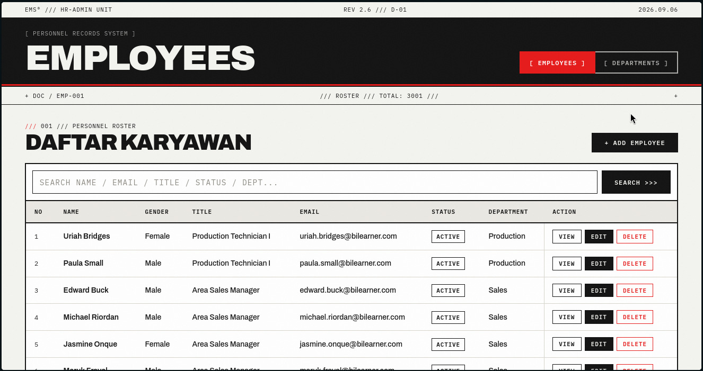
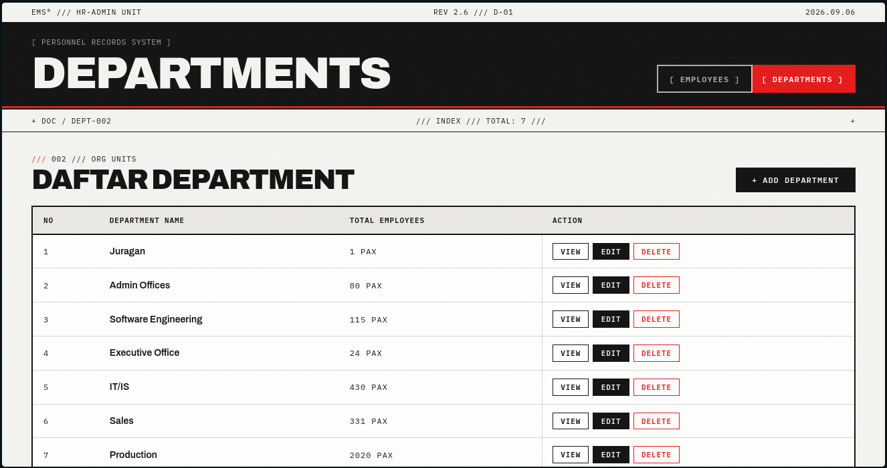

# Employee Management System

A Laravel web application for managing employees and departments in one place. It covers the full CRUD cycle for both entities, with search, pagination, and form validation. The project was built as a learning and portfolio project to practice Laravel MVC, Eloquent relationships, and basic Git/GitHub workflow.

## Preview

### Employee Management



### Department Management



## Features

- Employee CRUD (create, list, detail, edit, delete)
- Department CRUD (create, list, detail, edit, delete)
- Department–Employee relationship (one department has many employees)
- Employee search by name, email, title, status, and department
- Pagination (10 records per page, search query preserved across pages)
- Server-side form validation with per-field error messages
- Eager loading of the Employee → Department relationship
- Delete protection: a department that still has employees cannot be deleted
- Success/error notifications after create, update, and delete actions
- Empty states with a call-to-action when a list has no data

## Tech Stack

- PHP 8.3
- Laravel 13
- SQLite (default, via `.env.example`) — compatible with MySQL/MariaDB
- Blade templates
- Tailwind CSS (via CDN in Blade layouts)
- Eloquent ORM
- Git / GitHub (branches, Issues, Pull Requests)

## Database Structure

### departments

- `id`
- `dept_name`
- `created_at` / `updated_at`

### employees

- `id`
- `first_name`
- `last_name`
- `gender`
- `title`
- `email` (unique)
- `emp_status`
- `department_id` (foreign key → `departments.id`)
- `created_at` / `updated_at`

Relationship: **Department 1 → N Employees.**

- One department can have many employees.
- One employee belongs to one department.

## Installation

```bash
git clone <repository-url>
cd Employee-Management-System_Laravel/EMS

composer install

cp .env.example .env

php artisan key:generate
```

The default configuration uses SQLite, so no database server setup is needed. If you prefer MySQL/MariaDB, update the `DB_*` variables in `.env` accordingly.

Then run the migrations and start the server:

```bash
php artisan migrate
php artisan serve
```

Open `http://localhost:8000/employee` for the employee list or `http://localhost:8000/department` for the department list.

## Project Structure

The Laravel application lives in the `EMS/` directory. The parts most relevant to this project:

- `EMS/app/Models` — Eloquent models (`Employee`, `Department`), relationship definitions, and the `full_name` accessor
- `EMS/app/Http/Controllers` — `EmployeeController` and `DepartmentController` (CRUD, validation, search, pagination)
- `EMS/database/migrations` — table definitions for `departments` and `employees`, including the foreign key
- `EMS/resources/views` — Blade templates: shared layout, list pages, forms, and detail pages
- `EMS/routes/web.php` — resource routes for `employee` and `department`

## Development Notes

These notes document real issues encountered during development and what each one taught. They are kept here intentionally as evidence of the debugging process.

### Accessor: `full_name` is derived, not stored

The employee list shows a single Name column, but the database stores `first_name` and `last_name` as separate columns. The merged name is produced by an Eloquent accessor on the `Employee` model:

```php
use Illuminate\Database\Eloquent\Casts\Attribute;

protected function fullName(): Attribute
{
    return Attribute::make(
        get: fn (mixed $value, array $attributes) => trim(($attributes['first_name'] ?? '') . ' ' . ($attributes['last_name'] ?? '')),
    );
}
```

During development, the accessor returned nothing because the file imported the wrong `Attribute` class: PHP's built-in metadata attribute instead of Laravel's `Illuminate\Database\Eloquent\Casts\Attribute`. Since both share the same short name, the code looked correct but resolved to the wrong class. The issue was caused by an ambiguous import, and fixing it led to a better understanding of how PHP namespaces resolve identically named classes.

Takeaway: `first_name` and `last_name` remain the real database columns; `full_name` exists only for presentation.

### Eager loading and the N+1 problem

The employee list displays each employee's department name. The first version of the index action used a plain `Employee::paginate(10)`, which meant Laravel issued one extra query per employee to fetch its department (the N+1 query problem). The fix was to eager load the relationship:

```php
$employees = Employee::with('department')
    ->orderBy('id')
    ->paginate(10)
    ->withQueryString();
```

The same idea is applied elsewhere: the department list uses `withCount('employees')`, and the detail pages load the relation explicitly. This led to an understanding of when one upfront query replaces many repeated ones.

### Form, validation, model, and database names must match

At one point the employee form could not save. The cause was inconsistent naming across layers: the department dropdown used a different field name than the `department_id` the controller validated and the database expected, and the status input used `status` while the column is `emp_status`. The edit page had a related problem — the controller did not pass the department list to the view, so the dropdown failed to render.

The fix was to use `department_id` and `emp_status` consistently in the Blade field names, the controller validation rules, the model's `$fillable` array, and the migration columns, and to always pass `$departments` where a department dropdown is rendered.

Takeaway: in a form submission, the input name, the validation key, the fillable attribute, and the column name are four references to the same thing — if any one of them differs, the save fails.

### Table columns must match the header

The employee table once rendered 10 data cells per row against only 8 header columns, because it still referenced fields that do not exist in the database. The extra cells pushed the Action column out of view and forced horizontal scrolling. The issue was caused by view code drifting out of sync with the actual schema. Removing the non-existent columns and binding the department cell to the relationship (`$employee->department?->dept_name`) restored the 8-column layout.

Takeaway: the migration is the source of truth for which fields can be displayed; the view should never reference columns the schema does not have.

### Foreign key protection when deleting departments

The `employees` table holds a foreign key to `departments`, so deleting a department that still has employees would fail at the database level with a server error. Rather than letting that happen, `DepartmentController::destroy()` checks first and redirects with a friendly message:

```php
if ($department->employees()->exists()) {
    return redirect()->route('department.index')
        ->with('error', 'Cannot delete department because it still has associated employees.');
}
```

This led to an understanding of how foreign keys protect referential integrity, and why the application layer should translate a constraint violation into feedback the user can act on (reassign the employees first).

### Search implementation

The employee search runs in `EmployeeController::index`. When a `search` query parameter is present, the query matches it against `first_name`, `last_name`, `email`, `title`, and `emp_status`, plus the related department's `dept_name` via `whereHas`. `withQueryString()` keeps the search term applied while paging through results, and the view shows the active filter with a reset option.

## Learning Outcomes

Working on this project helped demonstrate and reinforce:

- Laravel MVC structure and resourceful routing
- Controllers handling CRUD, validation, search, and pagination
- Blade templating, including a shared layout and reusable partials
- Eloquent ORM: models, relationships (`belongsTo` / `hasMany`), and mass assignment via `$fillable`
- Accessors for presentation-only derived values
- Eager loading (`with`, `withCount`) and the N+1 query problem
- Pagination with preserved query strings
- Form validation with per-field error feedback
- Foreign keys and referential integrity in practice
- Database design for a one-to-many relationship
- Git branching and GitHub Issues / Pull Requests workflow
- Debugging by tracing a symptom back through view, controller, model, and schema layers

## Project Status

This is a learning and portfolio project. Its current scope is intentionally small: employee and department management with CRUD, search, pagination, validation, and relationship handling. It is not presented as a production HR system.

Possible future improvements:

- Authentication / authorization
- Role-based access control
- Dashboard with summary statistics
- Automated feature tests
- Advanced filtering and sorting
- Deployment
